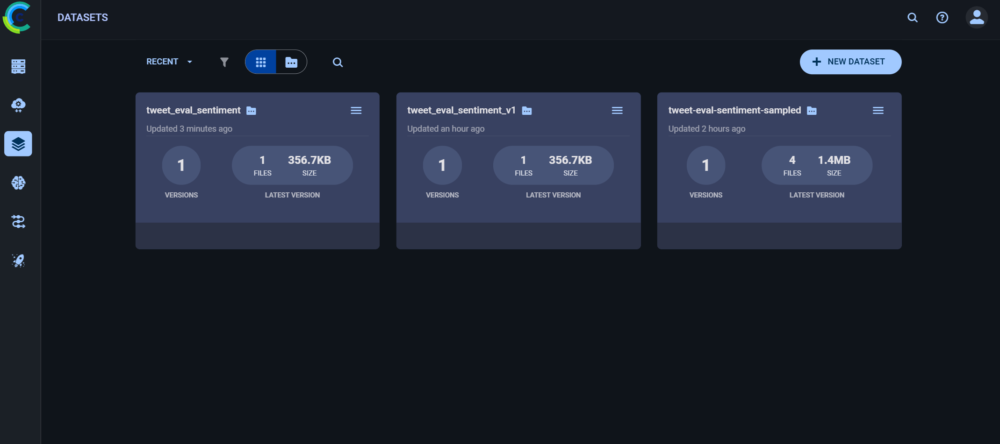
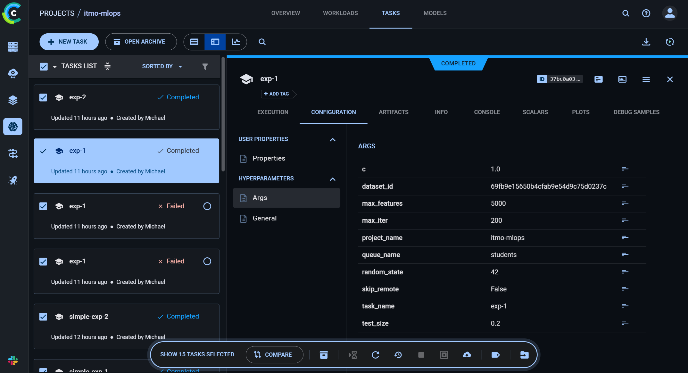
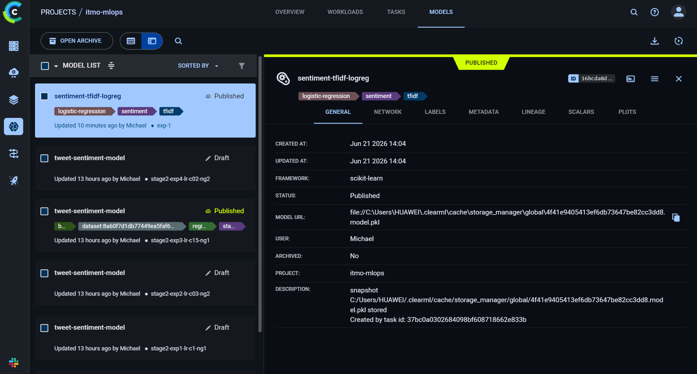

# Курсовой проект MLOps: классификация тональности твитов

Минимальный жизненный цикл ML-модели на базе **ClearML**: версионирование
датасета, удалённое обучение через ClearML Agent, логирование метрик и
артефактов, публикация модели в Model Registry, инференс через официальный
механизм **ClearML Serving** и пользовательский интерфейс на **Gradio**.

Решается задача классификации тональности твитов на три
класса: `negative`, `neutral`, `positive` (датасет `cardiffnlp/tweet_eval`).

## Структура проекта

```text
.
├── upload_dataset.py        # Этап 1: датасет -> ClearML Dataset
├── train.py                 # Этап 2: обучение через ClearML Agent
├── publish_model.py         # Этап 3: публикация модели в Model Registry
├── preprocess.py            # Этап 4: препроцессинг для ClearML Serving (custom engine)
├── serving/
│   ├── docker-compose.yml   # Этап 4: стек ClearML Serving (порт 9090)
│   └── example.env          # Этап 4: шаблон переменных окружения
├── app.py                   # Этап 5: Gradio UI поверх HTTP
├── data/tweet_eval.csv      # локальная копия датасета
├── requirements.txt
└── README.md
```

## Используемый стек

- Модель: `TfidfVectorizer` + `LogisticRegression` (scikit-learn).
- Эксперимент-трекинг и реестр: ClearML Server + ClearML Agent.
- Инференс: ClearML Serving (custom engine) в Docker.
- UI: Gradio (общается с endpoint только по HTTP, модель не загружает).

## Подготовка окружения

```powershell
python -m venv .venv
.\.venv\Scripts\Activate.ps1
pip install -r requirements.txt
```

## Инфраструктура

Предполагается развёрнутый локально ClearML Server:

- Web UI: `http://localhost:8080`
- API: `http://localhost:8008`
- Files: `http://localhost:8081`

Настройка SDK и запуск агента с очередью `students`:

```powershell
clearml-init
clearml-agent daemon --queue students
```

## Dataset в ClearML

Скрипт `upload_dataset.py`:

- скачивает выборку из `cardiffnlp/tweet_eval` (sentiment);
- сохраняет её в `data/tweet_eval.csv` (колонки `text`, `label_id`, `label`);
- создаёт ClearML Dataset в проекте `itmo-mlops`;
- добавляет файл и фиксирует версию через `finalize(auto_upload=True)`.

В терминале будет выведен `Dataset ID` — сохраните его, он нужен на этапе обучения.




## Этап 2. Обучение через ClearML Agent

Скрипт `train.py`:

- создаёт ClearML Task (`task_type=training`);
- логирует гиперпараметры через `task.connect(...)`;
- отправляет задачу в очередь через `task.execute_remotely(queue_name="students")`,
  поэтому обучение выполняется **агентом**, а git-commit фиксируется ClearML
  автоматически;
- получает данные из ClearML по `dataset_id`;
- обучает модель, логирует `accuracy`, `f1` (macro) и confusion matrix;
- сохраняет модель как artifact `model` (`outputs/model.pkl`).

Эксперимент 1:

```powershell
python train.py --dataset-id <DATASET_ID> --task-name exp-1 --c 1.0 --max-features 5000
```

Эксперимент 2:

```powershell
python train.py --dataset-id <DATASET_ID> --task-name exp-2 --c 0.3 --max-features 10000
```

В UI видны два эксперимента с различиями в параметрах и метриках,
у каждого есть artifact модели:



> Примечание: если нужно обучить локально без агента (для отладки), добавьте
> флаг `--skip-remote`.


## Этап 3. Model Registry

После выбора лучшего эксперимента модель публикуем в Model Registry.
Скрипт `publish_model.py`:

- берёт artifact `model` из выбранной задачи;
- создаёт `OutputModel` с именем, framework и тегами;
- публикует модель и печатает `Model ID`.

```powershell
python publish_model.py --task-id <BEST_TASK_ID>
```




## Этап 4. Inference Endpoint (ClearML Serving)

Используется официальный механизм ClearML Serving. Так как artifact — это
бандл `{"model", "vectorizer"}`, применяется **custom engine** с `preprocess.py`
(класс `Preprocess`: `load` загружает бандл, `process` делает TF-IDF и
`predict_proba`, `postprocess` возвращает `label`/`confidence`).

### 4.1. Создание сервиса

```powershell
clearml-serving create --name "itmo-sentiment-serving"
```

Команда выведет в консоли ID сервиса:

```text
New Serving Service created: id=<SERVING_TASK_ID>
```

### 4.2. Настройка окружения

Далее копируем шаблон и подставляем значения:

```powershell
Copy-Item serving/example.env serving/.env
```

В `serving/.env` укажите `CLEARML_API_ACCESS_KEY`, `CLEARML_API_SECRET_KEY` и
`CLEARML_SERVING_TASK_ID=<SERVING_TASK_ID>`. Хосты уже указывают на
`host.docker.internal`, чтобы контейнеры видели запущенный ClearML Server

### 4.3. Запуск стека

```powershell
docker compose --env-file serving/.env -f serving/docker-compose.yml up -d
```

Инференс-сервис поднимается на `http://127.0.0.1:9090` (порт 8080 занят
Web UI ClearML, поэтому используется 9090).

### 4.4. Деплой модели из Registry

```powershell
clearml-serving --id <SERVING_TASK_ID> model add `
  --engine custom `
  --endpoint "sentiment" `
  --preprocess preprocess.py `
  --name "sentiment-tfidf-logreg" `
  --project "itmo-mlops" `
  --model-id <MODEL_ID>
```

Сервис синхронизируется в течение ~1 минуты. Модель загружается именно из
ClearML (никаких локальных `.pkl` в обход реестра).

### 4.5. Примеры запросов

PowerShell:

```powershell
Invoke-RestMethod -Method Post `
  -Uri http://127.0.0.1:9090/serve/sentiment `
  -ContentType "application/json" `
  -Body '{"text":"i love this, absolutely fantastic day"}'

Invoke-RestMethod -Method Post `
  -Uri http://127.0.0.1:9090/serve/sentiment `
  -ContentType "application/json" `
  -Body '{"text":"the meeting is scheduled for monday afternoon"}'

Invoke-RestMethod -Method Post `
  -Uri http://127.0.0.1:9090/serve/sentiment `
  -ContentType "application/json" `
  -Body '{"text":"this is the worst service i have ever used"}'
```

curl:

```bash
curl -X POST "http://127.0.0.1:9090/serve/sentiment" \
  -H "Content-Type: application/json" \
  -d '{"text":"i love this, absolutely fantastic day"}'
```

Формат ответа:

```json
{
  "label": "positive",
  "confidence": 0.78,
  "probabilities": {"negative": 0.08, "neutral": 0.14, "positive": 0.78}
}
```

## Этап 5. UI (Gradio)

`app.py` отправляет HTTP-запрос на endpoint и отображает label, вероятности
классов и latency (время ответа). Модель напрямую не загружается. Endpoint
настраивается переменной `INFERENCE_ENDPOINT` (по умолчанию
`http://127.0.0.1:9090/serve/sentiment`).

```powershell
python app.py
```

UI доступен по адресу `http://127.0.0.1:7860`. При недоступном endpoint UI
показывает понятную ошибку вместо падения.

## Сводка по баллам

| Этап | Реализация |
|------|------------|
| Инфраструктура | ClearML Server + Agent, очередь `students` |
| Dataset | `upload_dataset.py`, ClearML Dataset с версией |
| Training + Agent | `train.py`, удалённый запуск, 2 эксперимента, метрики и artifact |
| Model Registry | `publish_model.py`, `OutputModel` с тегами и версией |
| Inference | ClearML Serving (custom engine) на порту 9090 |
| UI | Gradio поверх HTTP с latency и обработкой ошибок |
